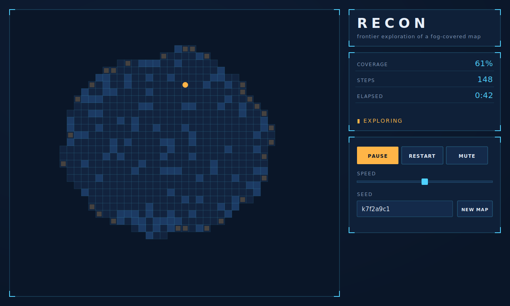

# Recon

**▶ Live demo → [apps.charliekrug.com/recon](https://apps.charliekrug.com/recon/)**

[](https://github.com/ctkrug/recon/actions/workflows/ci.yml)
[](LICENSE)

> Watch a robot map the unknown, live.

Recon drops a robot into a fog-covered map it has never seen and lets you
watch it explore. There is no pre-known grid to path across: the robot knows
only what its own sensor has swept, and it has to keep deciding where to look
next. The fog peels back cell by cell as it goes.

If you have watched a dozen A\* visualizers and found them a bit boring, this
is the harder, more interesting half of the problem they skip.



## Why it's different

Most "pathfinding visualizer" projects show a robot finding the shortest
route across a map it can already see in full. That problem is solved and the
genre is crowded.

Recon shows the part that comes first in real robotics: **exploration**. The
robot's job is not "get from A to B", it is "figure out where B even is". It
does that with **frontier-based exploration**, the same idea SLAM planners use
to drive real mobile robots into unmapped space:

- **Frontiers** are the boundary cells between known-free space and the
  unknown. They are detected live from the robot's own occupancy grid.
- Each frontier region is clustered, scored by size and distance, and the best
  one becomes the next target.
- The robot paths to it through known-free space, then sweeps, re-detects, and
  repeats.

The fog opens in an uneven, organic front as a result, not on a timer and not
on a scripted reveal. No two seeds explore the same way.

## How it works

1. **Occupancy grid.** The robot keeps its own grid of `unknown` / `free` /
   `wall` cells, built entirely from what its sensor has seen.
2. **Simulated sensor.** Each tick it casts Bresenham lines of sight out to
   its range, revealing cells until the first wall blocks each ray.
3. **Frontier detection.** Free cells that touch an unknown cell are frontier
   cells; adjacent ones cluster into regions so a wall of frontier scores as
   one target, not fifty noisy ones.
4. **Scoring and selection.** Each region scores on size minus distance, so the
   robot favors big nearby gains over a long trek for a marginal one, then
   plans a grid A\* path to it (retrying the next-best region if a target turns
   out unreachable).
5. **Repeat** until no reachable frontier is left. Coverage, steps, and elapsed
   time freeze, and a completion panel reports the run with a one-click restart.

Every sweep, frontier lock, step, and completion plays a short WebAudio tone
generated in code (no audio files); the mute toggle persists across reloads.

See [`docs/ARCHITECTURE.md`](docs/ARCHITECTURE.md) for the module map and data
flow, and [`docs/VISION.md`](docs/VISION.md) for the design rationale.

## Controls

- **Start / Pause** runs and halts the exploration.
- **Speed** sets how many ticks run per second.
- **Seed** generates a specific map; the same seed always reproduces the same
  map, so a run you like is shareable. **New map** rolls a fresh random seed.
- **Restart** replays the current seed from the start.
- **Mute** silences the synth SFX (the setting sticks between visits).

## Run it locally

```sh
npm install
npm run dev      # local dev server
npm test         # run the unit + property test suite
npm run build    # production build into dist/ (relative paths, subpath-safe)
```

Requires Node 20+.

## Tech

- **TypeScript** for the simulation core (occupancy grid, sensor, frontier
  detection, A\*): deterministic, framework-free, and unit-tested.
- **HTML5 Canvas** rendered at `devicePixelRatio` on `requestAnimationFrame`.
- **Vite** for the dev server and a single self-contained static build.
- **Vitest** and **fast-check** for example-based and property-based tests of
  the core; `sim/` sits at 100% line coverage.

## License

MIT. See [`LICENSE`](LICENSE).

---

More of Charlie's projects → [apps.charliekrug.com](https://apps.charliekrug.com)
